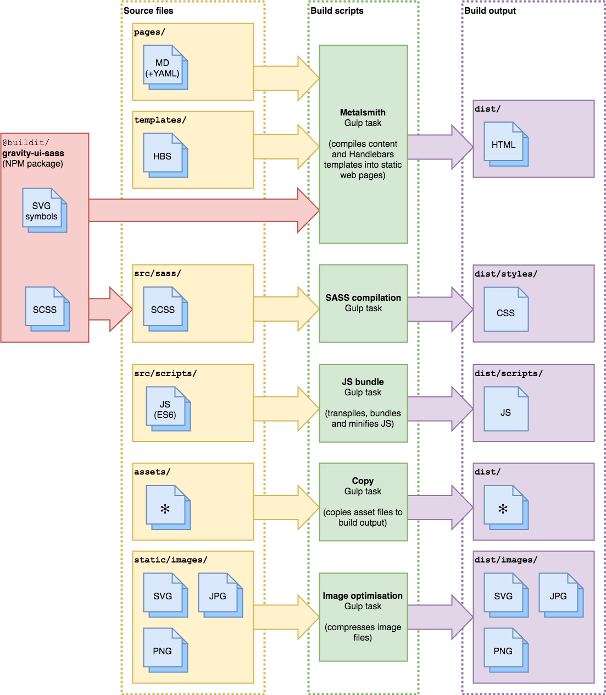

# Build process

The Buildit website uses [Gulp](https://gulpjs.com/) to perform builds. This document explains in more detail what the main tasks do.

**Note:** We consider our use of Gulp an implementation detail of our build process. The recommended command for performing builds is therefore `npm run-script build` (or `npm start` for local development), rather than invoking Gulp directly. Starting builds this way also eliminates the need to have Gulp installed globally on your system.

## Overview

## Metalsmith
_See: [`gulp/metalsmith.js`](../gulp/metalsmith.js)_

We use [Metalsmith](http://www.metalsmith.io/) (via [`gulpsmith`](https://github.com/pjeby/gulpsmith)) to generate our website's HTML pages and some auxilliary files like `sitemap.xml` and `robots.txt`. In broad strokes, this works as follows:

1. All [markdown files](https://daringfireball.net/projects/markdown/syntax) and text files in the `pages/` directory are read in and passed into the pipeline one by one.
1. If the files contain [YAML frontmatter](https://www.npmjs.com/package/front-matter), it is extracted and added to the metadata fields used by Metalsmith
    * The value of the **`layout` field** in the YAML data is expected to be the filename of the [Handlebars template](https://handlebarsjs.com/) (within the `templates/` folder) that should be used to render this page
1. The per-file YAML data is combined with data from a number of Metalsmith plug-ins:
    * Some global metadata about the site, added as the **`site`, `build`, `twitter*` and `og*` fields**
    * A custom plug-in that uses [Buildit's `job-listing library`](https://github.com/buildit/job-listings) to fetch our job ads from [SmartRecruiters](https://www.smartrecruiters.com/), group them by location and make the results available via the **`jobLocations` field**.
    * The [`metalsmith-collections` plug-in](https://github.com/segmentio/metalsmith-collections) to create the **`collections.locations` field** from all the files within `pages/locations`.
    * The [`metalsmith-page-titles`](https://github.com/hellatan/metalsmith-page-titles), which creates the **`pageTitle` field** that is a combination of the page's `title` and the website's title (e.g. "Careers | buildit @ wipro digital")
1. For markdown files, their contents are converted to HTML (which is placed into the **`contents` field**).
1. Finally, the Handlebars template (specified via the `layout` field) is rendered using all the fields as its context data.
    * For example, to render the `pageTitle` field within a template you can use `{{ pageTitle }}`.
    * In effect, this means that all fields that were in a markdown file's YAML frontmatter are available in the corresponding Handlebars template.
1. The output is saved to the `dist/` folder.
  

## SASS compilation

## JS bundling

## Image optimisation

## Asset copying

