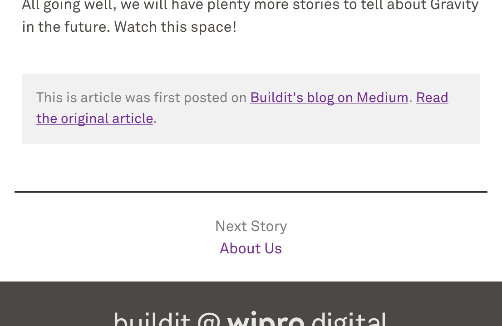

# Canonical URLs for republished content

Sometimes articles on the buildit website will are copies of articles that were first published elsewhere (for instance, buildit's Medium blog). Search engine algorithms tend to frown on duplicated content (since this is a tactic often used by spammy websites) but for legitimate cases (like permitted republications) they offer various means to [consolidate multiple copies of the same content under a single, _canonical_ URL](https://support.google.com/webmasters/answer/139066?hl=en). This is the URL most search engines will end up listing on results pages.

At buildit, we generally consider the location where an article was _first_ published to be its canonical copy. For example, when we publish posts on our Medium blog and subsequently re-publish them on the buildit website, the Medium copy is the canonical one. In such cases, the copy on the buildit website should link to the canonical version. This can be achieved as follows:

1. Add a `canonicalUrl` property, whose value is the canonical URL, to the article's frontmatter. This will add a `<link rel="canonical" href="...">` to the page's `<head>`.
    * On article pages, it will also make a "This article was originally published at: [URL]" message appear below the article, with a clickable link to the original version. However, for frequently referenced external sites, this can be improved by the following...
1. Also add an `originalSourceSiteId` property, whose value is the key of the desired external site in `metadata/external-sites.json`, to the article's frontmatter.
    * This will improve the presentation of the message that appears below the article so that it links to both the canonical copy of the article as well as the site where that article resides (see screenshot below).

