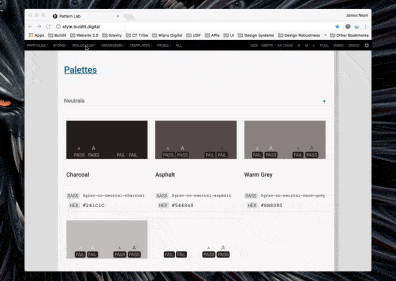

# Coding standards

## SASS / CSS
TBC. However, it is a good idea to follow [Gravity's own standards](https://github.com/buildit/gravity-ui-web/blob/develop/docs/naming-conventions.md) for consistency and also to make it easier to contribute any new UI components developed for the site upstream into the Gravity design system.

## JavaScript
Our JS code is organised as ES6 modules (so we use `import` / `export` syntax). `src/scripts/main.js` is the main entry point [our build](./build-process.md) uses to create the final JS bundle, so make sure your module is `import`ed there.

We use Prettier to lint and tidy-up our JS code - see [eslint-config-prettier](https://github.com/prettier/eslint-config-prettier) for more details.

**Note:** If you use [Visual Studio Code](https://code.visualstudio.com/) as your IDE, this project contains a workspace config that will make it automatically use Prettier to reformat your code on save.

## HTML
The majority of our HTML is a composition of components provided by Buildit's Gravity design system. Our HTML markup **must** therefore match the per-component markup that defines in its [Gravity living pattern library](http://style.buildit.digital/) (use the "Show Pattern Info" option to see the markup):

Additions or changes to the website's HTML **must** therefore always follow this process:

1. Does Gravity already provide a component for what you need? If yes, use it.
1. If not, does Gravity provide something close to what you need? If yes, please consider using that.
1. If your new component contains parts that exist in Gravity, then please make use of them.
1. Once you have finalised your new component's markup and associated CSS, please notify [the Gravity maintainers](https://github.com/orgs/buildit/teams/gravity-maintainers) so that they can consider it for inclusion into a future release of Gravity.

Where we produce Handlebars partials that map directly to a counterpart in Gravity's pattern library, please use the components Atomic Design category and name as the partial's filename. For example: `molecule-steps.hbs`.

Regardless of whether you are composing Gravity components or making bespoke ones, the final HTML build output for every page should always be [valid HTML5](https://validator.w3.org/). We also recommend that you familiarise yourself with the [metadata formats we use](./metadata.md).

